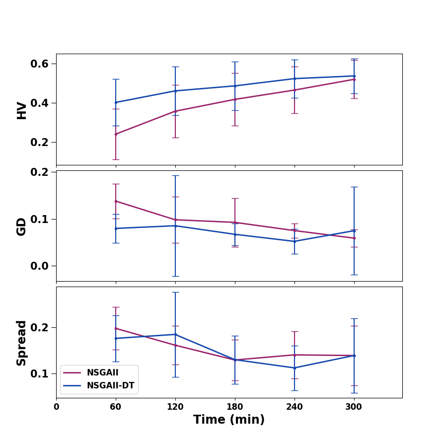
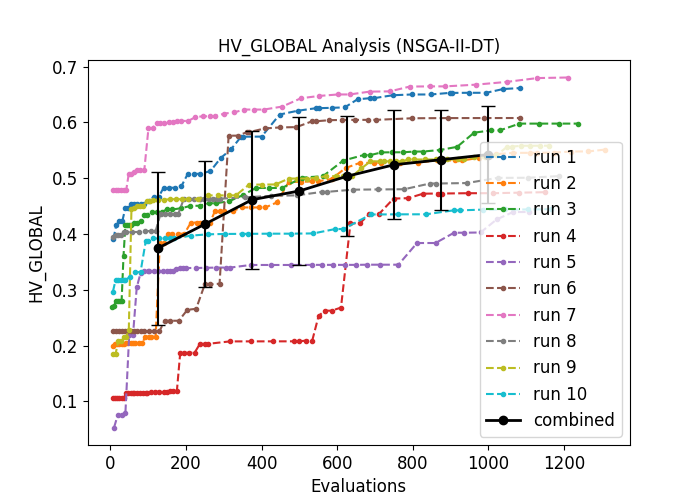

# NSGAII-DT Replication Results

This repository holds the results of the NSGAII-DT replication study from the journal paper (ISTJ) ["Reflections on Surrogate-Assisted Search-Based Testing: A Taxonomy and Two Replication Studies based on Industrial ADAS and Simulink Models"](https://www.sciencedirect.com/science/article/abs/pii/S0950584923001404).

## Algorithm

The reflection study has been conducted with the support of the testing framework [OpenSBT](https://git.fortiss.org/opensbt/opensbt-core).
The implementation of NSGAII-DT is based on pymoo and an excerpt of the implementation is provided [here](algorithm/nsga2_dt_sim.py).

## Combined Results
The *Hypervolume/General Distance/Spread*analysis results after 10 runs are available here: 

The detailed *Hypervolume* analysis results are available here: [HV](/hv/)

NSGAII         |  NSGAII-DT
:-------------------------:|:-------------------------:
  |  

The *Spread* analysis results are available here: [Spread](/sp/) 

NSGAII         |  NSGAII-DT
:-------------------------:|:-------------------------:
 |  

The *General Distance* analysis results are available here: [GD](/gd/) 

NSGAII         |  NSGAII-DT
:-------------------------:|:-------------------------:
 | 

## Results Single Runs

The results of each single run of NSGAII are available here: [Single Runs NSGAII](NSGA-II/)

The results of each single run of NSGAII-DT are available here: [Single Runs NSGAII-DT](NSGA-II-DT/)

## Replication Study Authors

Lev Sorokin (sorokin@fortiss.org) \
Damir Safin (safin@fortiss.org)
